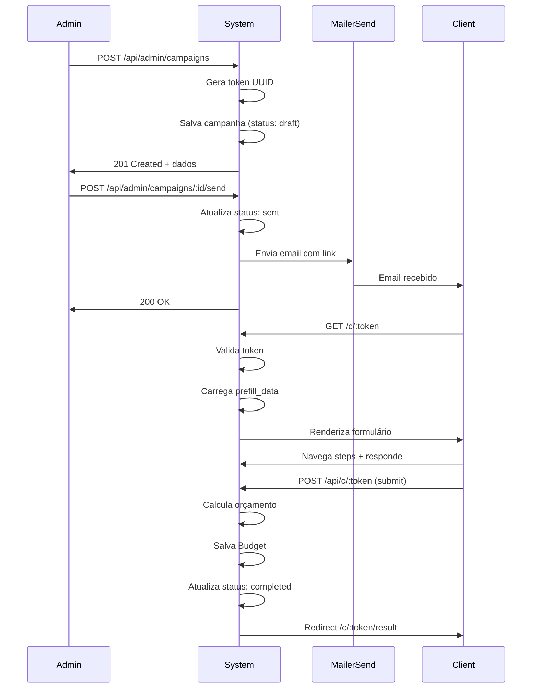

# Yetu Budget - Product Requirements Document (PRD)

## 1. Visão Geral do Projeto

### Nome do Projeto
**Yetu Budget** - Sistema de Gestão de Orçamentos

### Descrição Resumida
Plataforma web para criação e gerenciamento de orçamentos de planos de sustentação para a Yetu Tech. Permite ao admin criar campanhas com links únicos para clientes responderem questionários de orçamento.

### Problema a Resolver
- Processos manuais de criação de orçamentos
- Dificuldade em acompanhar status dos orçamentos
- Falta de histórico de respostas dos clientes
- Necessidade de enviar orçamentos personalizados

### Usuários Alvo
- **Admin**: Equipa interna da Yetu Tech
- **Cliente**: Empresas que solicitam orçamento

---

## 2. Stack Tecnológico

| Componente | Tecnologia | Versão |
|------------|------------|--------|
| Backend | Fastify | ^4.26.0 |
| ORM | Sequelize | ^6.37.0 |
| Banco de Dados | SQLite | 3 |
| Template Engine | Pug | Via @fastify/pug |
| CSS | TailwindCSS | Via CDN |
| Autenticação | JWT | Via @fastify/jwt |
| Email | MailerSend SDK | ^2.0.0 |
| Exportação | PDF + Excel | pdfmake + xlsx |

### Credenciais MailerSend
```
MAILERSEND_API_KEY=mlsn.c1d578da8c9c5d98528f481c0a7bd77e2fa7903cfb9854d5dba652a696be8b0a
MAILERSEND_FROM=info@test-xkjn41md9y94z781.mlsender.net
MAILERSEND_FROM_NAME=Lombongo Exchange
```

---

## 3. Estrutura do Banco de Dados

### 3.1 Diagrama ER

```
┌─────────────────┐         ┌──────────────────┐         ┌─────────────────┐
│     User        │         │    Campaign      │         │     Budget      │
├─────────────────┤         ├──────────────────┤         ├─────────────────┤
│ id (PK)         │         │ id (PK)          │         │ id (PK)         │
│ email           │────┐    │ token (UK)       │    ┌────│ campaign_id (FK)│
│ password_hash   │    └────│ client_name      │────┘    │ plan_name       │
│ created_at      │         │ company_name     │         │ monthly_price   │
└─────────────────┘         │ client_email     │         │ discounted_price│
                            │ status           │         │ details (JSON)  │
                            │ link_reusable    │         │ response_data   │
                            │ expires_at       │         │ created_at      │
                            │ prefill_data     │         └─────────────────┘
                            │ config           │
                            │ user_id (FK)     │
                            │ created_at       │
                            └──────────────────┘
```

### 3.2 Models

#### User (Administradores)
| Campo | Tipo | Obrigatório | Descrição |
|-------|------|-------------|-----------|
| id | INTEGER (PK) | ✓ | AutoIncrement |
| email | STRING | ✓ | Unique, formato email |
| password_hash | STRING | ✓ | BCrypt hash |
| created_at | DATETIME | ✓ | Timestamp automático |

#### Campaign (Campanhas)
| Campo | Tipo | Obrigatório | Descrição |
|-------|------|-------------|-----------|
| id | INTEGER (PK) | ✓ | AutoIncrement |
| token | STRING | ✓ | UUID único, identificador público |
| client_name | STRING | ✓ | Nome do cliente |
| company_name | STRING | ✗ | Nome da empresa |
| client_email | STRING | ✗ | Email para envio do link |
| status | ENUM | ✓ | draft, sent, responding, completed |
| link_reusable | BOOLEAN | ✓ | Default: false |
| expires_at | DATETIME | ✗ | Prazo de expiração do link |
| prefill_data | JSON | ✗ | Dados pré-preenchidos no formulário |
| config | JSON | ✗ | Configurações customizadas de perguntas |
| user_id | INTEGER (FK) | ✗ | Criador da campanha |
| created_at | DATETIME | ✓ | Timestamp automático |

#### Budget (Orçamentos)
| Campo | Tipo | Obrigatório | Descrição |
|-------|------|-------------|-----------|
| id | INTEGER (PK) | ✓ | AutoIncrement |
| campaign_id | INTEGER (FK) | ✗ | Campanha associada |
| plan_name | STRING | ✗ | Plano selecionado (starter/professional/enterprise) |
| monthly_price | DECIMAL | ✗ | Valor mensal base |
| discounted_price | DECIMAL | ✗ | Valor com desconto aplicado |
| details | JSON | ✗ | Detalhes do orçamento (itens selecionados) |
| response_data | JSON | ✗ | Todas as respostas do questionário |
| client_name | STRING | ✗ | Nome do cliente (denormalizado) |
| company_name | STRING | ✗ | Nome da empresa (denormalizado) |
| client_email | STRING | ✗ | Email do cliente (denormalizado) |
| created_at | DATETIME | ✓ | Timestamp automático |

---

## 4. Especificação de Funcionalidades

### 4.1 Autenticação Admin

#### Login
- **Endpoint**: POST /admin/login
- **Campos**: email, password
- **Validação**: Email deve ser válido, password mínimo 6 caracteres
- **Segurança**: Password hasheada com BCrypt (10 rounds)
- **Sessão**: JWT token em HttpOnly cookie
- **Expiração**: 24 horas

#### Logout
- **Endpoint**: POST /admin/logout
- **Ação**: Clear cookie JWT
- **Redirect**: Para página de login

#### Proteção de Rotas
- Todas rotas `/admin/*` requerem JWT válido
- Todas rotas `/api/admin/*` requerem JWT válido
- Token inválido → redirect para login

### 4.2 Dashboard Admin

#### Stats Globais
- Total de campanhas criadas
- Campanhas em cada status (draft, sent, responding, completed)
- Total de orçamentos gerados
- Receita total estimada (soma de discounted_price)
- Campanhas pendentes (status != completed)

#### Quick Actions
- Botão "Nova Campanha" → /admin/campaigns/new
- Botão "Ver Orçamentos" → /admin/budgets
- Lista de campanhas recentes (últimas 5)
- Lista de orçamentos recentes (últimos 5)

### 4.3 Gestão de Campanhas

#### Criar Nova Campanha

**Campos do Formulário:**
| Campo | Tipo | Obrigatório | Validação |
|-------|------|-------------|-----------|
| client_name | STRING | ✓ | Mínimo 3 caracteres |
| company_name | STRING | ✗ | - |
| client_email | STRING | ✗ | Formato email válido |
| link_reusable | BOOLEAN | ✗ | Default: false |
| expires_at | DATETIME | ✗ | Data futura |
| prefill_data | TEXTAREA | ✗ | JSON válido (opcional) |

**Fluxo de Criação:**
1. Admin preenche formulário
2. Sistema gera token UUID único
3. Campanha salva com status "draft"
4. Redirect para lista de campanhas

#### Editar Campanha
- Permite modificar todos os campos
- Token não pode ser alterado
- Status é gerenciado automaticamente

#### Ações em Campanhas

**Enviar por Email:**
- Usa MailerSend SDK
- Envia para `client_email` da campanha
- Template HTML com link para formulário
- Atualiza status para "sent"

**Copiar Link:**
- Retorna URL completa: `{baseUrl}/c/{token}`
- Admin pode copiar manualmente
- Não altera status

**Duplicar:**
- Cria cópia da campanha
- Novo token gerado
- Todos os campos copiados
- Status volta para "draft"

**Eliminar:**
- Soft delete (implementar flag `deleted_at`)
- Ou hard delete com confirmação

#### Status Pipeline
```
draft → sent → responding → completed
  │       │         │           │
  │       │         │           └── Orçamento submetido
  │       │         └── Cliente acessou link
  │       └── Email enviado / link copiado
  └── Criada, não enviada
```

### 4.4 Formulário Público (Cliente)

#### Acesso ao Formulário
- **URL**: `/c/:token`
- **Validações**:
  - Token deve existir
  - Status deve ser "sent" ou "responding"
  - Se `expires_at` existe, deve ser futuro
  - Se `link_reusable` é false e já existe budget, mostrar orçamento existente

#### Carregamento de Dados
1. Busca campanha pelo token
2. Carrega perguntas do arquivo data.json
3. Se `prefill_data` existe, preenche campos
4. Se `config` existe, pode sobrescrever perguntas

#### Fluxo do Questionário (8 Steps)

**Step 1 - Operação e Negócio:**
- peak_hours (radio): morning, afternoon, evening
- critical_time (radio): economy, balanced, premium
- downtime_impact (select): low, medium, high, critical

**Step 2 - Garantia de Serviço:**
- uptime (radio): 99, 99.5, 99.9
- emergency_name + emergency_phone (fields)

**Step 3 - Como Prefere Trabalhar:**
- autonomy (radio): full, consult, total
- crisis_management (radio): auto, wake
- meeting_frequency (select): daily, 3days, weekly, biweekly, monthly

**Step 4 - Segurança e Dados:**
- backup (radio): weekly, daily, realtime
- log_retention (select): 3months, 6months, 1year, 2years
- priority (radio): stability, features
- compliance (checkbox): lgpd, pci, iso

**Step 5 - Custos e Infraestrutura:**
- msg_limit (radio): stop, auto
- traffic_spike (radio): no, yes, massive
- domains (select): 1, 3, 5, 10, 10+

**Step 6 - Crescimento e Melhorias:**
- evolution (radio): maintain, improve
- new_features (textarea)

**Step 7 - Suporte e Comunicação:**
- communication (radio-grid): email, whatsapp, call, video
- contact_hours (select): business, extended, anytime

**Step 8 - Personalize seu Plano:**
- extras (checkbox-grid): relatórios, backup, etc.
- training_people (number, conditional)
- dev_hours (number): 0-40
- payment_period (radio-grid): monthly, quarterly, semiannual
- company_name + company_email (fields)

#### Navegação
- Botão "Anterior" (escondido no step 1)
- Botão "Próximo" → "Calcular Orçamento" no último step
- Barra de progresso (8 steps)
- Labels dos steps com navegação

#### Cálculo do Orçamento

**Lógica de Seleção do Plano:**
```javascript
let plan = 'professional';

if (criticalTime === 'premium' || uptime === '99.9' || backup === 'realtime') {
  plan = 'enterprise';
} else if (criticalTime === 'economy' && backup === 'weekly') {
  plan = 'starter';
}
```

**Preços Base:**
- Starter: $999/mês
- Professional: $1299/mês
- Enterprise: $1999/mês

**Extras Calculados:**
- Meeting frequency: daily ($200), 3days ($100)
- Video call: $30 (se communication === 'video')
- Extras selecionados: soma dos preços
- Training: $100 × training_people
- Dev hours: $50 × dev_hours

**Descontos por Periodicidade:**
- Monthly: 0%
- Quarterly: 10%
- Semiannual: 15%

**Setup Fee:** $500 (sempre aplicado)

#### Submissão
- **Endpoint**: POST /api/c/:token
- **Ação**: Salva Budget na BD
- **Atualização**: Campaign.status = 'completed'
- **Resposta**: Redirect para página de resultado
- **Notificação**: Email para admin (opcional)

#### Página de Resultado
- Mostra plano selecionado
- Valores: mensal, com desconto, setup, total 3 meses
- Lista de features do plano
- Detalhes dos extras
- Botões: Imprimir, Enviar WhatsApp, Refazer

### 4.5 Gestão de Orçamentos

#### Lista de Orçamentos
- **URL**: /admin/budgets
- **Colunas**: Data, Cliente, Empresa, Plano, Valor Mensal, Valor com Desconto
- **Filtros**:
  - Data: início e fim
  - Plano: starter, professional, enterprise
  - Busca: cliente ou empresa (like %text%)
- **Ordenação**: Data (desc/asc), Valor (desc/asc)
- **Paginação**: 20 itens por página

#### Detalhes do Orçamento
- **URL**: /admin/budgets/:id
- Mostra todos os dados do budget
- Respostas completas do questionário
- Botão para exportar PDF individual

#### Exportação

**Excel (.xlsx):**
- Colunas: ID, Data, Cliente, Empresa, Email, Plano, Valor Mensal, Valor c/ Desconto, Setup, Total 3 Meses, Extras, Respostas (JSON)
- Nome do arquivo: `orcamentos_YYYYMMDD.xlsx`

**PDF:**
- Template formatado com logo
- Dados do cliente
- Plano e valores
- Lista de features
- Termos e condições

### 4.6 Email Notifications

#### Template 1 - Link Enviado ao Cliente
**Assunto**: Seu orçamento Yetu Tech está pronto

**Conteúdo**:
```html
Olá {client_name},

Preparamos um formulário personalizado para você.

Acesse: {link}

Ou copie e cole no navegador: {link}

Atenciosamente,
Lombongo Exchange
```

#### Template 2 - Novo Orçamento Recebido (Admin)
**Assunto**: Novo orçamento recebido - {client_name}

**Conteúdo**:
```html
Novo orçamento recebido!

Cliente: {client_name}
Empresa: {company_name}
Plano: {plan_name}
Valor: {discounted_price}

Ver detalhes: {admin_link}
```

---

## 5. API Endpoints

### 5.1 Autenticação

| Método | Rota | Auth | Descrição |
|--------|------|------|-----------|
| GET | /admin/login | ✗ | Página de login |
| POST | /api/auth/login | ✗ | Login, seta JWT cookie |
| POST | /api/auth/logout | ✓ | Logout, limpa cookie |

### 5.2 Dashboard

| Método | Rota | Auth | Descrição |
|--------|------|------|-----------|
| GET | /admin/dashboard | ✓ | Página dashboard com stats |
| GET | /api/admin/stats | ✓ | JSON com estatísticas |

### 5.3 Campanhas

| Método | Rota | Auth | Descrição |
|--------|------|------|-----------|
| GET | /admin/campaigns | ✓ | Lista campanhas |
| GET | /admin/campaigns/new | ✓ | Form criar |
| GET | /admin/campaigns/:id | ✓ | Form editar |
| POST | /api/admin/campaigns | ✓ | Criar campanha |
| PUT | /api/admin/campaigns/:id | ✓ | Editar campanha |
| DELETE | /api/admin/campaigns/:id | ✓ | Eliminar campanha |
| POST | /api/admin/campaigns/:id/send | ✓ | Enviar email |
| GET | /api/admin/campaigns/:id/link | ✓ | Gerar link |
| POST | /api/admin/campaigns/:id/duplicate | ✓ | Duplicar |

### 5.4 Orçamentos

| Método | Rota | Auth | Descrição |
|--------|------|------|-----------|
| GET | /admin/budgets | ✓ | Lista orçamentos |
| GET | /admin/budgets/:id | ✓ | Detalhes orçamento |
| GET | /api/admin/budgets | ✓ | API lista (JSON) |
| GET | /api/admin/budgets/export/excel | ✓ | Download Excel |
| GET | /api/admin/budgets/export/pdf | ✓ | Download PDF |

### 5.5 Público

| Método | Rota | Auth | Descrição |
|--------|------|------|-----------|
| GET | /c/:token | ✗ | Formulário cliente |
| GET | /api/config | ✗ | Perguntas do formulário (JSON) |
| POST | /api/c/:token | ✗ | Submeter respostas |
| GET | /c/:token/result | ✗ | Página de resultado |

---

## 6. UI/UX Specification

### 6.1 Design System

#### Paleta de Cores
| Nome | Hex | Uso |
|------|-----|-----|
| Primary | #0ea5e9 | Botões primários, links |
| Primary Dark | #0284c7 | Hover states |
| Primary Light | #f0f9ff | Backgrounds suaves |
| Success | #22c55e | Success messages, checkmarks |
| Success Light | #f0fdf4 | Success backgrounds |
| Error | #ef4444 | Error messages, validation |
| Error Light | #fef2f2 | Error backgrounds |
| Warning | #f59e0b | Warnings, alerts |
| Slate 900 | #0f172a | Texto principal |
| Slate 700 | #334155 | Texto secundário |
| Slate 500 | #64748b | Texto terciário |
| Slate 200 | #e2e8f0 | Bordas leves |
| Slate 100 | #f1f5f9 | Backgrounds |
| White | #ffffff | Cards, inputs |

#### Tipografia
| Elemento | Fonte | Peso | Tamanho | Cor |
|----------|-------|------|---------|-----|
| H1 | Plus Jakarta Sans | 800 (ExtraBold) | 36px | Slate 900 |
| H2 | Plus Jakarta Sans | 700 (Bold) | 24px | Slate 900 |
| H3 | Plus Jakarta Sans | 600 (Semibold) | 18px | Slate 900 |
| Body | Plus Jakarta Sans | 400 (Regular) | 16px | Slate 600 |
| Small | Plus Jakarta Sans | 400 (Regular) | 14px | Slate 500 |
| Label | Plus Jakarta Sans | 600 (Semibold) | 14px | Slate 700 |
| Button | Plus Jakarta Sans | 600 (Semibold) | 16px | White |

#### Componentes

**Botões:**
- Primary: bg-primary-500, rounded-2xl, shadow, hover:bg-primary-600
- Secondary: border-2, border-slate-300, hover:bg-slate-100
- Success: bg-green-500, hover:bg-green-600
- Danger: bg-red-500, hover:bg-red-600
- Tamanhos: sm (px-4 py-2), md (px-6 py-3), lg (px-8 py-4)

**Cards:**
- Background: white
- Border-radius: rounded-3xl (24px)
- Shadow: shadow-xl shadow-slate-200/50
- Padding: p-6 (mobile), p-8 (desktop)

**Inputs:**
- Border: border-2 border-slate-200
- Border-radius: rounded-2xl (16px)
- Padding: p-4
- Focus: border-primary-500, ring-3 ring-primary-500/15

**Option Cards:**
- Transition: all 0.25s cubic-bezier(0.4, 0, 0.2, 1)
- Hover: translate-y-[-2px], shadow aumentado
- Selected: border-primary-500, bg-primary-50, ring-3

### 6.2 Layout

**Admin:**
- Sidebar fixa (esquerda) em desktop
- Topbar com usuário e logout
- Content area com padding
- Mobile: sidebar colapsa em hambúrguer

**Público:**
- Centralizado, max-width 2xl (672px)
- Header com logo
- Progress bar fixo
- Step content dinâmico
- Footer com navegação

### 6.3 Responsividade

**Breakpoints:**
- Mobile: < 640px
- Tablet: 640px - 1024px
- Desktop: > 1024px

**Mobile Adjustments:**
- Cards: padding reduzido (p-5)
- Fontes: tamanhos menores
- Grid: 1 coluna
- Sidebar: hambúrguer menu

---

## 7. Fluxos de Negócio

### 7.1 Fluxo Completo - Criar e Enviar Campanha



### 7.2 Fluxo - Duplicar Campanha

1. Admin clica "Duplicar" na lista
2. Sistema busca campanha original
3. Sistema cria nova com:
   - Novo token UUID
   - Mesmos campos (client_name, company_name, etc.)
   - prefill_data e config copiados
   - status = 'draft'
   - created_at = now
4. Redirect para edição da nova campanha

### 7.3 Fluxo - Reutilização de Link

**Cenário 1: Link não reutilizável (default)**
- Cliente submete orçamento → Budget criado
- Cliente tenta acessar link novamente
- Sistema detecta Budget existente
- Mostra página do orçamento já gerado
- Não permite novo envio

**Cenário 2: Link reutilizável**
- Cliente pode submeter múltiplas vezes
- Cada submissão cria novo Budget
- Campanha fica com status 'responding'
- Admin vê todos os orçamentos na lista

---

## 8. Requisitos Não-Funcionais

### 8.1 Segurança

- **Autenticação**: JWT com HttpOnly cookies (não acessível via JS)
- **Senhas**: BCrypt com 10 rounds de salt
- **SQL Injection**: Protegido por Sequelize (parameterized queries)
- **XSS**: Escapar output em templates Pug
- **CSRF**: Não aplicável (stateless JWT)
- **Rate Limiting**: Implementar em rotas públicas (5 req/min)
- **Validação Input**: Joi ou Zod para validação de schemas
- **Headers**: Helmet.js para security headers

### 8.2 Performance

- **Database**: Índices em:
  - campaigns.token (unique lookup)
  - campaigns.status (filtros frequentes)
  - budgets.campaign_id (joins)
  - budgets.created_at (ordenação)
- **Cache**: Cache de data.json em memória
- **Static Assets**: CDN para Tailwind (já via CDN)
- **Query Optimization**: Eager loading de relacionamentos

### 8.3 Disponibilidade

- **Error Handling**: 
  - Try-catch em todos controllers
  - Error handler global do Fastify
  - Páginas de erro customizadas (404, 500)
- **Logging**: Pino (default do Fastify) para logs
- **Health Check**: Endpoint /health para monitoramento
- **Graceful Shutdown**: Fechar conexões DB ao encerrar

### 8.4 Backup e Recuperação

- **Database**: SQLite file backup diário
- **Location**: `/backups/database_YYYYMMDD.sqlite`
- **Retention**: Manter últimos 30 dias
- **Restore**: Copiar arquivo de backup

---

## 9. Variáveis de Ambiente

Arquivo: `.env`

```bash
# ==========================================
# Yetu Budget - Environment Configuration
# ==========================================

# Server Configuration
PORT=3000
NODE_ENV=development
BASE_URL=http://localhost:3000

# JWT Configuration
JWT_SECRET=yetu_budget_secret_key_2024_change_in_production
JWT_EXPIRES_IN=24h

# Database
DB_PATH=./database.sqlite

# MailerSend Configuration
MAILERSEND_API_KEY=mlsn.c1d578da8c9c5d98528f481c0a7bd77e2fa7903cfb9854d5dba652a696be8b0a
MAILERSEND_FROM=info@test-xkjn41md9y94z781.mlsender.net
MAILERSEND_FROM_NAME=Lombongo Exchange

# Admin Default Credentials (for initial setup)
ADMIN_EMAIL=admin@yetu.tech
ADMIN_PASSWORD=change_me_in_production
```

---

## 10. Estrutura de Arquivos

```
yetu_budget/
├── api/
│   ├── src/
│   │   ├── index.js                 # Entry point Fastify
│   │   ├── config/
│   │   │   ├── database.js         # Sequelize config
│   │   │   ├── mail.js            # MailerSend config
│   │   │   └── init-db.js         # DB initialization
│   │   ├── models/
│   │   │   ├── index.js           # Exporta todos models
│   │   │   ├── User.js            # Model User
│   │   │   ├── Campaign.js        # Model Campaign
│   │   │   └── Budget.js          # Model Budget
│   │   ├── routes/
│   │   │   ├── auth.js            # Rotas auth
│   │   │   ├── campaigns.js       # CRUD campanhas
│   │   │   ├── budgets.js         # Rotas orçamentos
│   │   │   └── public.js          # Rotas públicas
│   │   ├── middleware/
│   │   │   └── auth.js            # JWT middleware
│   │   ├── services/
│   │   │   ├── mail.js            # Email service
│   │   │   ├── export.js          # PDF/Excel export
│   │   │   └── budget.js          # Cálculo orçamento
│   │   └── views/
│   │       ├── layout.pug         # Layout base
│   │       ├── admin/
│   │       │   ├── login.pug      # Login page
│   │       │   ├── dashboard.pug  # Dashboard
│   │       │   ├── campaigns.pug  # Lista campanhas
│   │       │   ├── campaign-form.pug # Form CRUD
│   │       │   └── budgets.pug    # Lista orçamentos
│   │       └── public/
│   │           ├── form.pug       # Formulário cliente
│   │           └── result.pug     # Resultado orçamento
│   ├── .env                       # Environment vars
│   ├── package.json               # Dependencies
│   └── database.sqlite            # SQLite DB (criado em runtime)
└── data.json                      # Perguntas do formulário
```

---

## 11. Dependências

### package.json

```json
{
  "name": "yetu-budget",
  "version": "1.0.0",
  "description": "Sistema de Gestão de Orçamentos Yetu Tech",
  "main": "src/index.js",
  "type": "module",
  "scripts": {
    "start": "node src/index.js",
    "dev": "node --watch src/index.js",
    "db:init": "node src/config/init-db.js"
  },
  "dependencies": {
    "@fastify/cookie": "^9.3.0",
    "@fastify/jwt": "^8.0.0",
    "@fastify/pug": "^3.0.0",
    "@mailersend/mailersend": "^2.0.0",
    "bcrypt": "^5.1.1",
    "dotenv": "^16.4.0",
    "fastify": "^4.26.0",
    "sequelize": "^6.37.0",
    "sqlite3": "^5.1.7",
    "uuid": "^9.0.1",
    "xlsx": "^0.18.5",
    "pdfmake": "^0.2.10"
  },
  "devDependencies": {},
  "engines": {
    "node": ">=18.0.0"
  }
}
```

---

## 12. Critérios de Aceitação

### 12.1 Autenticação
- [ ] Admin pode fazer login com email/senha válidos
- [ ] JWT é gerado e armazenado em cookie HttpOnly
- [ ] Rotas admin requerem autenticação válida
- [ ] Logout limpa o cookie
- [ ] Senhas são hasheadas com BCrypt

### 12.2 Dashboard
- [ ] Mostra estatísticas atualizadas
- [ ] Lista campanhas recentes
- [ ] Lista orçamentos recentes
- [ ] Links rápidos funcionam

### 12.3 Campanhas
- [ ] Admin pode criar campanha com cliente/empresa
- [ ] Token único é gerado automaticamente
- [ ] Link pode ser enviado por email (MailerSend)
- [ ] Link pode ser copiado para clipboard
- [ ] Campanha pode ser editada
- [ ] Campanha pode ser duplicada
- [ ] Campanha pode ser eliminada
- [ ] Status é atualizado corretamente

### 12.4 Formulário Público
- [ ] Cliente acessa via link /c/:token
- [ ] Dados pré-importados aparecem preenchidos
- [ ] Validação de token (ativo, não expirado)
- [ ] Navegação entre 8 steps funciona
- [ ] Cálculo do orçamento está correto
- [ ] Submissão cria Budget na BD
- [ ] Status da campanha atualiza para completed
- [ ] Página de resultado mostra dados corretos

### 12.5 Orçamentos
- [ ] Lista mostra todos orçamentos
- [ ] Filtros por data, plano e busca funcionam
- [ ] Paginação funciona
- [ ] Exportação Excel gera arquivo correto
- [ ] Exportação PDF gera arquivo correto
- [ ] Detalhes mostram todas as informações

### 12.6 Email
- [ ] Envio por MailerSend funciona
- [ ] Template de link para cliente é correto
- [ ] Template de notificação para admin é correto (opcional)

### 12.7 Segurança
- [ ] JWT em HttpOnly cookie
- [ ] Senhas hasheadas
- [ ] Proteção contra SQL injection
- [ ] Input sanitization
- [ ] Rotas protegidas por auth

---

## 13. Roadmap Futuro

### Fase 1 - MVP (Atual)
- [x] Autenticação JWT
- [x] CRUD Campanhas
- [x] Formulário público
- [x] Cálculo de orçamento
- [x] Lista de orçamentos
- [x] Exportação Excel/PDF
- [x] Email com MailerSend

### Fase 2 - Melhorias
- [ ] Dashboard com gráficos
- [ ] Webhook para notificações (Slack/Discord)
- [ ] Multi-idioma (PT/EN)
- [ ] Tema dark/light
- [ ] Anexos em campanhas (logo, docs)

### Fase 3 - Enterprise
- [ ] Multi-tenant (várias empresas)
- [ ] Roles (admin, manager, viewer)
- [ ] API REST completa
- [ ] Mobile app
- [ ] Integração com CRM (HubSpot, etc)

---

## 14. Notas de Implementação

### 14.1 Considerações Importantes

1. **Token Único**: Usar `uuidv4()` para garantir unicidade global
2. **JSON Fields**: Usar `JSON.parse()`/`JSON.stringify()` para campos JSON
3. **Dates**: Sempre usar UTC no backend, formatar no frontend
4. **Emails**: Testar templates no MailerSend antes de deploy
5. **PDF**: Usar tabelas simples para garantir compatibilidade
6. **Excel**: Formatar headers em negrito, aplicar filtros

### 14.2 Decisões de Design

1. **Pug vs React**: Pug escolhido por simplicidade, server-side rendering
2. **SQLite vs PostgreSQL**: SQLite para MVP simples, fácil backup
3. **Tailwind CDN vs Build**: CDN para desenvolvimento rápido
4. **JWT vs Session**: JWT stateless, escala melhor

### 14.3 Limitações Conhecidas

1. SQLite não suporta concorrência alta (ok para uso interno)
2. Tailwind CDN tem limitações (não purge CSS)
3. Email em spam folder (configurar SPF/DKIM)

---

**Document Version**: 1.0  
**Last Updated**: 2024  
**Author**: Development Team  
**Status**: Ready for Implementation
